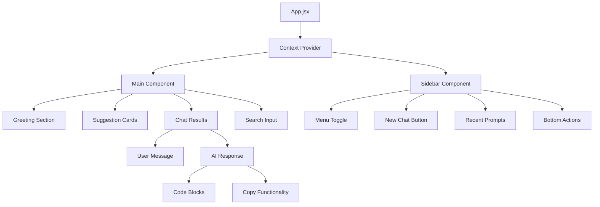

# 🤖 Gemini Clone

A modern, responsive React.js application that replicates the Google Gemini AI interface with enhanced features and professional styling.


## ✨ Features

### 🎨 **Modern UI/UX**

- Clean, professional interface inspired by Google Gemini
- Responsive design that works on all devices
- Smooth animations and micro-interactions
- Glass-morphism effects and modern styling

### 💬 **Chat Functionality**

- Real-time conversation with AI
- Typing indicators and loading animations
- Message history and recent prompts
- New chat functionality

### 🔧 **Enhanced Code Display**

- Syntax-highlighted code blocks
- Copy-to-clipboard functionality
- Professional code formatting
- Support for multiple programming languages

### 📱 **Mobile Responsive**

- Optimized for mobile devices
- Touch-friendly interface
- Collapsible sidebar on mobile
- Adaptive layouts for different screen sizes

### 🎯 **Smart Features**

- Clickable suggestion cards
- Recent conversation history
- Auto-formatting of responses
- Enhanced text rendering with markdown support

## 🚀 Getting Started

### Prerequisites

- Node.js (v14 or higher)
- npm or yarn package manager
- Google Gemini API key

### Installation

1. **Clone the repository**

   ```bash
   git clone https://github.com/yourusername/gemini-clone.git
   cd gemini-clone
   ```

2. **Install dependencies**

   ```bash
   npm install
   # or
   yarn install
   ```

3. **Set up environment variables**
   Create a `.env` file in the root directory:

   ```env
   VITE_GEMINI_API_KEY=your_gemini_api_key_here
   ```

4. **Start the development server**

   ```bash
   npm run dev
   # or
   yarn dev
   ```

5. **Open your browser**
   Navigate to `http://localhost:5173`

## 🏗️ Project Structure

```
Gemini-Clone/
├── public/                          # Static assets
│   ├── vite.svg                     # Vite logo
│   └── index.html                   # HTML template
├── src/                             # Source code
│   ├── assets/                      # Static resources
│   │   ├── assets.js                # Asset exports
│   │   ├── bulb_icon.png           # Suggestion card icon
│   │   ├── code_icon.png           # Code-related icon
│   │   ├── compass_icon.png        # Navigation icon
│   │   ├── gallery_icon.png        # Image upload icon
│   │   ├── gemini_icon.png         # AI assistant avatar
│   │   ├── history_icon.png        # History/activity icon
│   │   ├── menu_icon.png           # Hamburger menu icon
│   │   ├── message_icon.png        # Message/chat icon
│   │   ├── mic_icon.png            # Voice input icon
│   │   ├── plus_icon.png           # New chat icon
│   │   ├── question_icon.png       # Help/FAQ icon
│   │   ├── send_icon.png           # Send message icon
│   │   ├── setting_icon.png        # Settings icon
│   │   ├── user_icon.png           # User avatar
│   │   └── youtube_icon.png        # YouTube icon
│   ├── components/                  # React components
│   │   ├── Main/                    # Main chat interface
│   │   │   ├── Main.jsx            # Main component logic
│   │   │   └── Main.css            # Main component styles
│   │   └── Sidebar/                 # Navigation sidebar
│   │       ├── Sidebar.jsx         # Sidebar component logic
│   │       └── Sidebar.css         # Sidebar component styles
│   ├── config/                      # Configuration files
│   │   └── gemini.js               # Gemini API configuration
│   ├── context/                     # React Context
│   │   └── Context.jsx             # Global state management
│   ├── App.jsx                      # Root component
│   ├── App.css                      # Global app styles
│   ├── index.css                    # Base CSS styles
│   └── main.jsx                     # Application entry point
├── .env                             # Environment variables
├── .gitignore                       # Git ignore rules
├── package.json                     # Dependencies and scripts
├── package-lock.json               # Dependency lock file
├── vite.config.js                  # Vite configuration
└── README.md                        # Project documentation
```

## 🏛️ Architecture Overview

### **Component Architecture**



### **Data Flow Architecture**

```
┌─────────────────┐    ┌──────────────────┐    ┌─────────────────┐
│   User Input    │───▶│  Context State   │───▶│  Gemini API     │
│                 │    │                  │    │                 │
│ • Text Input    │    │ • input          │    │ • runChat()     │
│ • Card Clicks   │    │ • loading        │    │ • API Response  │
│ • New Chat      │    │ • resultData     │    │                 │
└─────────────────┘    │ • showResult     │    └─────────────────┘
                       │ • recentPrompt   │             │
                       │ • prevPrompts    │             │
                       └──────────────────┘             │
                                │                       │
                                ▼                       │
                       ┌──────────────────┐             │
                       │   UI Components  │◀────────────┘
                       │                  │
                       │ • Main.jsx       │
                       │ • Sidebar.jsx    │
                       │ • Result Display │
                       └──────────────────┘
```

### **State Management Flow**

```
User Action ──▶ Context Method ──▶ State Update ──▶ Component Re-render
     │               │                   │                │
     │               │                   │                ▼
     │               │                   │         ┌─────────────┐
     │               │                   │         │   UI Update │
     │               │                   │         └─────────────┘
     │               │                   │
     │               ▼                   ▼
     │        ┌─────────────┐    ┌─────────────┐
     │        │ API Call    │    │ Local State │
     │        │ (if needed) │    │ Changes     │
     │        └─────────────┘    └─────────────┘
     │               │
     │               ▼
     │        ┌─────────────┐
     │        │ Response    │
     │        │ Processing  │
     │        └─────────────┘
     │               │
     └───────────────┘
```

## 🎯 Key Components

### **Main Component** (`src/components/Main/Main.jsx`)

- **Purpose**: Primary chat interface and user interaction hub
- **Responsibilities**:
  - Renders greeting screen with suggestion cards
  - Manages chat result display (user + AI messages)
  - Handles input field and send functionality
  - Processes card clicks for quick prompts
- **State Dependencies**: `Context` for all chat-related state
- **Key Features**:
  - Responsive design with mobile optimization
  - Code block rendering with copy functionality
  - Loading animations and error handling

### **Sidebar Component** (`src/components/Sidebar/Sidebar.jsx`)

- **Purpose**: Navigation and chat session management
- **Responsibilities**:
  - Toggle between expanded/collapsed states
  - Display recent conversation history
  - Provide new chat functionality
  - Show navigation options (Help, Activity, Settings)
- **State Dependencies**: `Context` for prompt history and chat management
- **Key Features**:
  - Mobile-responsive collapse to icon-only mode
  - Recent prompt truncation for better UX
  - Smooth animations and transitions

### **Context Provider** (`src/context/Context.jsx`)

- **Purpose**: Centralized state management and API integration
- **State Variables**:
  ```javascript
  {
    input: "",              // Current user input
    loading: false,         // API call loading state
    resultData: "",         // Formatted AI response
    recentPrompt: "",       // Last user prompt
    prevPrompts: [],        // History of all prompts
    showResult: false       // Toggle between greeting/chat view
  }
  ```
- **Key Methods**:
  - `onSent()`: Handles API calls and response processing
  - `newChat()`: Resets chat state for new conversation
  - `delayPara()`: Creates typing animation effect
- **API Integration**: Google Gemini API with error handling

## 🔧 Technical Architecture

### **Frontend Architecture Pattern**

- **Pattern**: Component-Based Architecture with Context API
- **State Management**: React Context + useState hooks
- **Styling**: CSS Modules with responsive design
- **Build Tool**: Vite for fast development and optimized builds

### **API Integration Layer**

```javascript
// src/config/gemini.js
import { GoogleGenerativeAI } from "@google/generative-ai";

const apiKey = import.meta.env.VITE_GEMINI_API_KEY;
const genAI = new GoogleGenerativeAI(apiKey);
const model = genAI.getGenerativeModel({ model: "gemini-pro" });

async function runChat(prompt) {
  const result = await model.generateContent(prompt);
  return result.response.text();
}
```

### **Response Processing Pipeline**

1. **Raw API Response** → Text from Gemini API
2. **Markdown Processing** → Convert `**bold**`, `*italic*`, etc.
3. **Code Block Detection** → Identify and format ``` code blocks
4. **HTML Generation** → Create structured HTML with copy buttons
5. **Streaming Display** → Word-by-word animation rendering

### **Responsive Design Strategy**

- **Mobile-First Approach**: Base styles for mobile, enhanced for desktop
- **Breakpoint System**:
  - `480px`: Small mobile devices
  - `768px`: Tablets and large mobile
  - `1200px`: Desktop and wide screens
- **Component Adaptation**: Sidebar collapses, text sizes adjust, touch optimization

### **Performance Optimizations**

- **Code Splitting**: Components loaded as needed
- **Lazy Loading**: Images and assets optimized
- **Memoization**: Prevent unnecessary re-renders
- **Efficient State Updates**: Minimal state changes for better performance

### **Security Considerations**

- **Environment Variables**: API keys stored securely
- **Input Sanitization**: User input validation
- **XSS Prevention**: Safe HTML rendering with `dangerouslySetInnerHTML`
- **API Rate Limiting**: Handled by loading states

## 🔧 Configuration

### **API Setup**

1. Get your Gemini API key from [Google AI Studio](https://makersuite.google.com/app/apikey)
2. Add it to your `.env` file
3. The API configuration is handled in `src/config/gemini.js`

### **Customization**

- **Colors**: Modify CSS custom properties in `Main.css`
- **Fonts**: Update font families in CSS files
- **Layout**: Adjust responsive breakpoints in media queries
- **Features**: Add new functionality in respective components

## 📱 Responsive Design

The application is fully responsive with breakpoints for:

- **Desktop**: 1200px and above
- **Tablet**: 768px - 1199px
- **Mobile**: 480px - 767px
- **Small Mobile**: Below 480px

### Mobile Features:

- Collapsible sidebar (icon-only mode)
- Touch-optimized interface
- Adaptive text sizing
- Optimized code block display

## 🎨 Styling Features

### **Code Blocks**

- Syntax highlighting for multiple languages
- Copy-to-clipboard functionality
- Professional formatting
- Horizontal scrolling for long lines

### **Typography**

- Modern font stack
- Proper text hierarchy
- Enhanced readability
- Responsive text sizing

### **Animations**

- Smooth transitions
- Loading animations
- Hover effects
- Micro-interactions

## 🔧 Available Scripts

```bash
# Development
npm run dev          # Start development server
npm run build        # Build for production
npm run preview      # Preview production build
npm run lint         # Run ESLint

# Dependencies
npm install          # Install all dependencies
npm update           # Update dependencies
```

## 🌟 Features in Detail

### **Enhanced Response Formatting**

- **Bold text**: `**text**` → **text**
- **Italic text**: `*text*` → _text_
- **Code blocks**: `code` with syntax highlighting
- **Headings**: `#`, `##`, `###` support
- **Lists**: Proper bullet and numbered lists

### **Copy Functionality**

- One-click code copying
- Visual feedback on copy
- Automatic clipboard integration
- Error handling for unsupported browsers

### **Smart UI Elements**

- Suggestion cards with click-to-use
- Recent prompt history
- Loading states with animations
- Error handling and user feedback

## 🚀 Deployment

### **Vercel (Recommended)**

1. Push your code to GitHub
2. Connect your repository to Vercel
3. Add environment variables in Vercel dashboard
4. Deploy automatically

### **Netlify**

1. Build the project: `npm run build`
2. Upload the `dist` folder to Netlify
3. Configure environment variables
4. Set up continuous deployment

### **Manual Deployment**

1. Run `npm run build`
2. Upload the `dist` folder to your hosting provider
3. Configure environment variables on your server

## 🤝 Contributing

1. Fork the repository
2. Create a feature branch: `git checkout -b feature/amazing-feature`
3. Commit your changes: `git commit -m 'Add amazing feature'`
4. Push to the branch: `git push origin feature/amazing-feature`
5. Open a Pull Request

## 📝 License

This project is licensed under the MIT License - see the [LICENSE](LICENSE) file for details.

## 🙏 Acknowledgments

- Google Gemini AI for the API
- React.js community for excellent documentation
- Vite for the fast build tool
- All contributors and testers

## 📞 Support

If you have any questions or need help:

- Open an issue on GitHub
- Check the documentation
- Review the code comments

## 🔮 Future Enhancements

- [ ] Dark/Light theme toggle
- [ ] Voice input support
- [ ] File upload functionality
- [ ] Export conversation feature
- [ ] Multiple conversation tabs
- [ ] Custom AI model selection
- [ ] Offline mode support

---

**Made with ❤️ by Arpit**

_Star ⭐ this repository if you found it helpful!_
